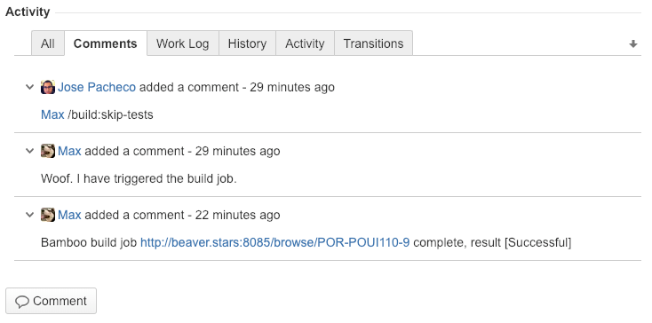

# jira-bot
Inspired by K8s bot https://github.com/k8s-ci-robot. Jira Bot listens for slash commands in comments to trigger bamboo builds, deployments, and manage source in bitbucket. The ultimate goal is to add support for all operations needed to perform a production release.



## Command Structure
@bot /command:param=value,param2=value

"@bot" is what you type into Jira and it will convert that to "[~bot]". The bot name is customizable. Simply create a Jira account with your desired bot name.


## Supported Commands
### @bot /build
This will search source for a branch matching the Jira issue key and will create a plan branch in Bamboo.

#### Params
@bot /build:skip-tests

This will create a custom Bamboo build and set the variable skipTests = true. You may then reference that variable in your plan to skip your tests.

```
#!/bin/bash -e

if [ "${bamboo.skipTests}" = "true" ]; then
    echo
    echo ----------------------------------
    echo "[x] Skipping Tests"
    echo
    exit 0
fi

./run-tests.sh
```

